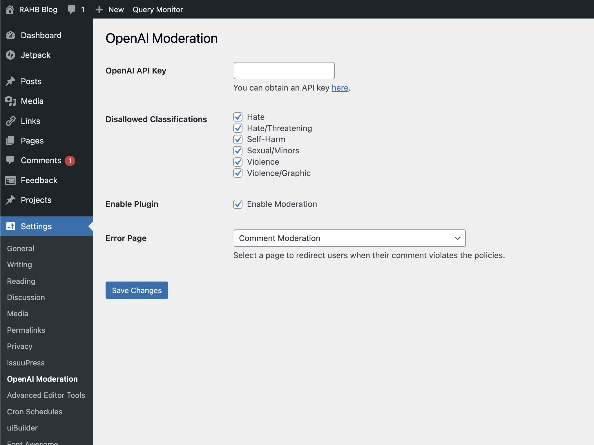

# OpenAI Moderation WordPress Plugin

This WordPress plugin filters input fields in text areas using the [OpenAI Moderation API](https://platform.openai.com/docs/guides/moderation/overview). It helps ensure that user-submitted content is respectful and allows you to control which content classifications are blocked on your website.

### Forever Free, No Pro Version!

We’re proud to announce that this plugin will always be 100% free, with no plans for a “Pro” or paid version. Our goal is to provide a reliable and accessible solution for the community, and we’re committed to keeping it that way.

### Get It From WordPress.org:
### [wordpress.org/plugins/openai-moderation](https://wordpress.org/plugins/openai-moderation/)

## Features

- Configure the OpenAI API key and disallowed classifications.
- Enable or disable the plugin easily from the settings page.
- Moderate comments before they are saved in the database.
- Redirect users to a selected page when their comment contains content that violates the disallowed classifications.

## Installation

1. Download the latest ZIP file from the [releases page](https://github.com/RAHB-REALTORS-Association/OpenAI-Moderation-WP/releases/) and extract it to the `/wp-content/plugins/` directory, or install the plugin through the WordPress.org plugins directory.
2. Activate the plugin through the **Plugins** screen in WordPress.
3. Navigate to the **Settings > OpenAI Moderation** screen to configure the plugin.

## Configuration

1. Obtain an OpenAI API key by signing up at [beta.openai.com/signup](https://beta.openai.com/signup/), and going to this page: [platform.openai.com/account/api-keys](https://platform.openai.com/account/api-keys).
2. Go to the **Settings > OpenAI Moderation** screen in your WordPress admin area.
3. Enter your OpenAI API key in the **OpenAI API Key** field.
4. Select the content categories you want to block in the **Disallowed Classifications** field.
5. Check the **Enable OpenAI Moderation** checkbox to enable the plugin.
6. Select the page to redirect to in the **Redirect Page** dropdown.
7. Click **Save Changes** to save your settings.

## Usage

Once the plugin is enabled and configured, it will automatically moderate comments on your website. If a user tries to post a comment that contains content that violates the allowed 
classifications, they will be redirected to a page and the comment will not be posted.

You can extend the plugin to moderate other types of content, such as user-submitted posts, by using the appropriate hooks and filters in WordPress.

## FAQ

1. **Is there any cost associated with using the OpenAI Moderation API?**

   The OpenAI Moderation API is a separate service provided by [OpenAI](https://openai.com), and it may have its own pricing structure. You can check the [OpenAI website](https://platform.openai.com/docs/guides/moderation/overview) for the current pricing details. The OpenAI Moderation WordPress Plugin itself is free and does not have a paid version.

2. **What data is sent to the OpenAI API?**

   Only the content of the comment is sent to the OpenAI API for moderation. No personally identifiable information (PII) or other sensitive data is sent. Please see the [OpenAI privacy policy](https://openai.com/policies/privacy-policy) for more details.

3. **What happens if the OpenAI API is unreachable or there's an error in the response?**

   If the OpenAI API is unreachable or there's an error in the response, the comment moderation process will fail, and the comment will be allowed to be posted as-is. This ensures that users can still interact with your website even in case of temporary API issues.

4. **Can I customize the error message shown to users when their comment is rejected?**

   Yes, you can customize the error message by creating a dedicated error page in your WordPress admin area and selecting it in the plugin settings. If no error page is configured, a generic WordPress error message will be shown instead.

5. **Is the OpenAI Moderation WordPress Plugin compatible with other WordPress plugins?**

   The plugin should work well with most WordPress plugins. However, compatibility issues may arise with other plugins that modify the comment submission process or interact with the OpenAI API. If you encounter any compatibility issues, please open a [bug report issue](https://github.com/RAHB-REALTORS-Association/OpenAI-Moderation-WP/issues).

6. **Can I use the OpenAI Moderation WordPress Plugin to moderate other types of user-submitted content?**

   While the plugin is designed to moderate comments by default, you can extend its functionality to moderate other types of content, such as user-submitted posts, by using the appropriate hooks and filters in WordPress.

## Troubleshooting

If the plugin is not working as expected, make sure that your OpenAI API key is valid and that the **Enable OpenAI Moderation** checkbox is checked in the plugin settings.

## Support and Contributions

While we are thrilled to receive your pull requests and issue reports, please note that we cannot guarantee support or address all feedback. Our team will prioritize security-related reports, as outlined in our [security policy](SECURITY.md). We appreciate your understanding, and we encourage you to contribute to the ongoing improvement of this plugin.

Thank you for using and supporting our plugin!

## License

This plugin is licensed under the GPLv2 license. See the [LICENSE](LICENSE) file for more information.
